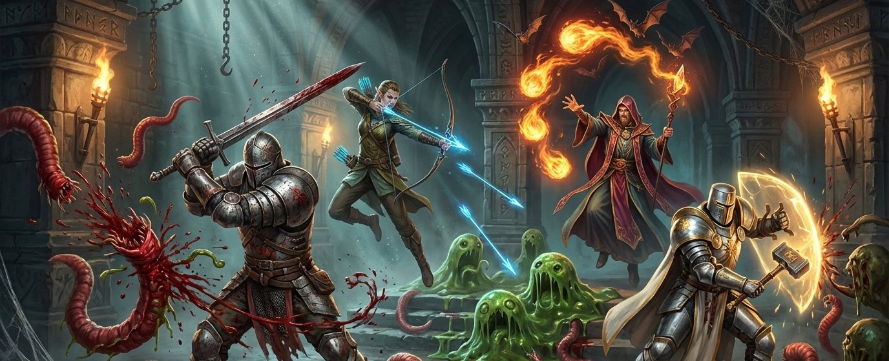
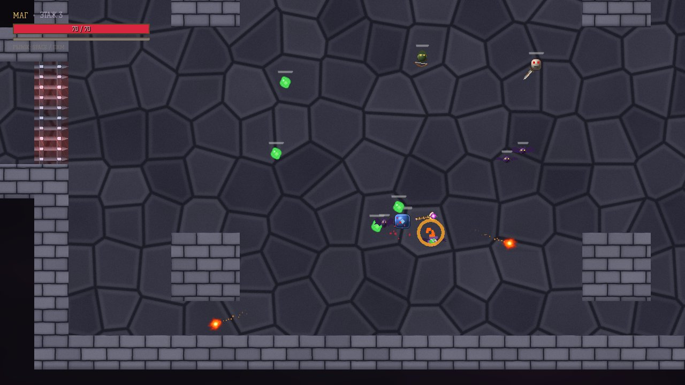
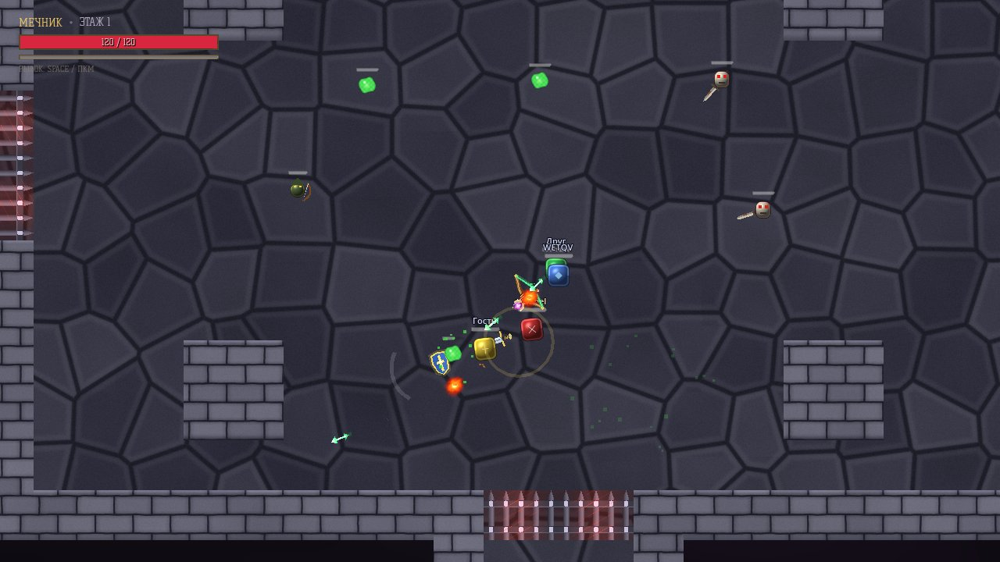
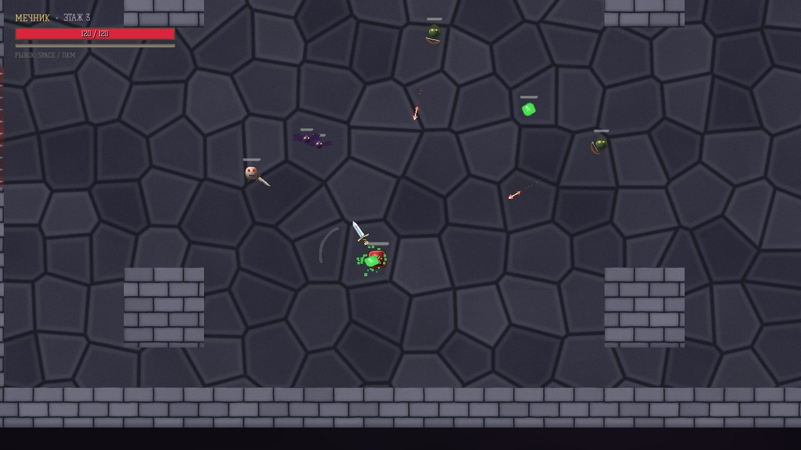
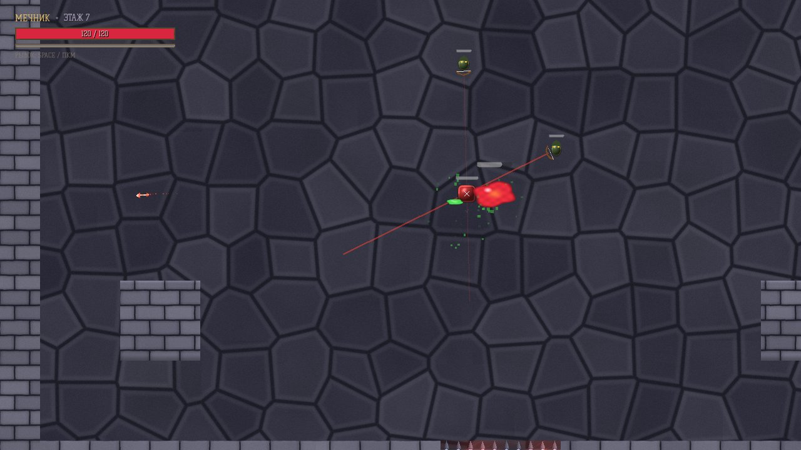
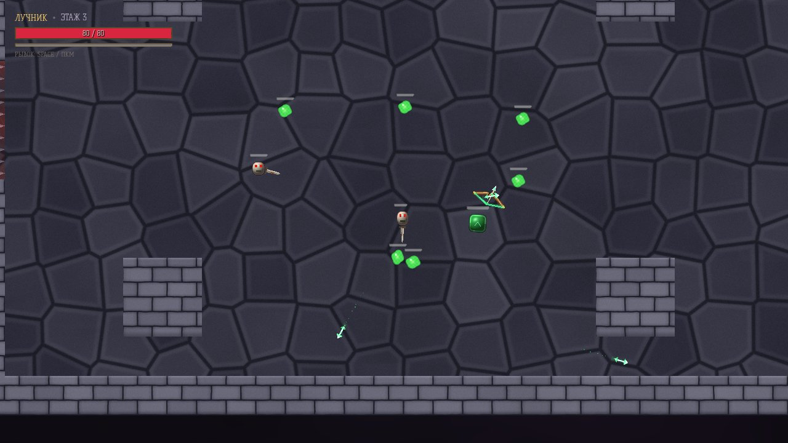
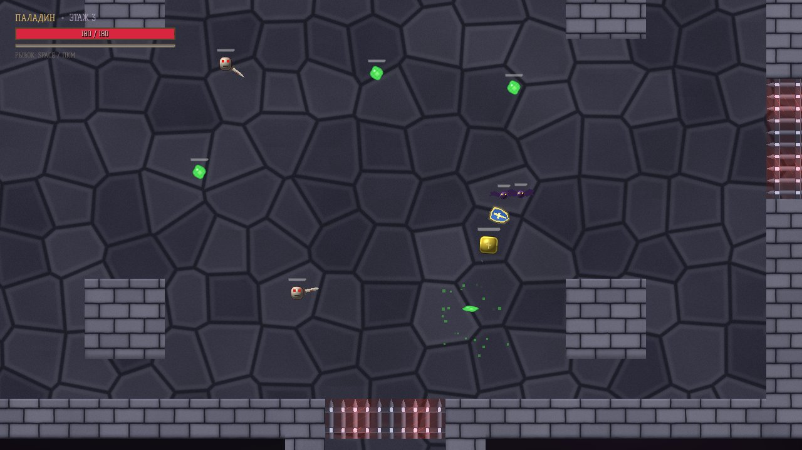
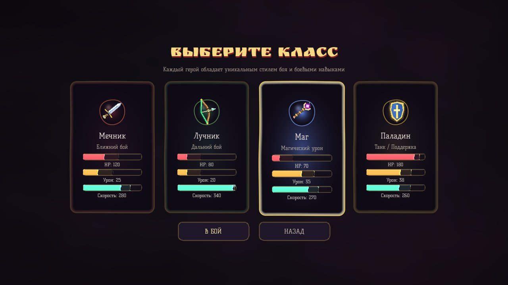
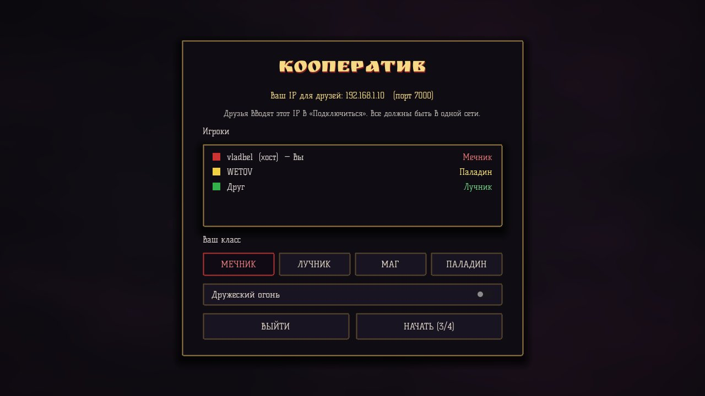

<p align="center">
  
</p>

<h1 align="center">🐛 SwormVlood</h1>

<p align="center">
  <b>Кооперативный roguelike twin-stick shooter про тёмное подземелье.</b><br>
  Спускайтесь на семь этажей вниз в одиночку или вчетвером по сети — и не пропадайте 😄
</p>

<p align="center">
  
  
  
  
  
</p>

<p align="center">
  <a href="#-скриншоты">Скриншоты</a> •
  <a href="#-классы">Классы</a> •
  <a href="#-кооператив">Кооператив</a> •
  <a href="#-запуск">Запуск</a> •
  <a href="#-чеклист-разработки">Чеклист</a>
</p>

---

## 🎬 Скриншоты

<table>
  <tr>
    <td width="50%"><br><sub>Маг: огненные шары против смешанной встречи</sub></td>
    <td width="50%"><br><sub>Кооператив: четыре класса в одной комнате</sub></td>
  </tr>
  <tr>
    <td><br><sub>Мечник: взмах меча, стрелы вражеских лучников</sub></td>
    <td><br><sub>7-й этаж: слайм-босс и линии прицела лучников</sub></td>
  </tr>
  <tr>
    <td><br><sub>Лучник: бой на дистанции</sub></td>
    <td><br><sub>Паладин: щит, молот и священная волна</sub></td>
  </tr>
  <tr>
    <td><br><sub>Выбор класса</sub></td>
    <td><br><sub>Лобби: игроки, классы, дружеский огонь</sub></td>
  </tr>
</table>

---

## 🎮 Особенности

- ⚔️ **Четыре класса** со своим оружием и стилем боя — от танка-паладина до хрупкого мага.
- 🗺️ **Процедурные подземелья**: сетка комнат (старт, бой, сундук, святилище, босс), новое подземелье на каждом этаже.
- 👾 **Враги с характером**: слаймы кружат и прыгают, скелеты замахиваются мечом, лучники держат дистанцию и целятся, летучие мыши пикируют стаями. Рой (SwarmManager) распределяет атаки между игроками.
- 🌐 **Кооператив на 2–4 игрока** по локальной сети или Radmin VPN: хост-авторитет, сглаживание движения, проверка каждой атаки на хосте.
- 🌀 **Семь этажей**: портал в комнате босса, слайм-босс на седьмом.
- 🧪 **Проверяемость**: автоматический сетевой и балансный стенд ([tests/](tests/net/README.md)) с отчётами «до/после».

## 🛡️ Классы

| | Класс | HP | Урон | Скорость | Стиль |
| --- | --- | --- | --- | --- | --- |
| 🗡️ | **Мечник** | 120 | 25 | 280 | Ближний бой, быстрые взмахи |
| 🏹 | **Лучник** | 80 | 20 | 340 | Дальний бой, самый быстрый |
| 🔥 | **Маг** | 70 | 35 | 270 | Огненные шары, хрупкий |
| ✝️ | **Паладин** | 180 | 38 | 260 | Щит и молот, священная волна, таран рывком, −25% входящего урона |

У всех классов есть рывок с короткой неуязвимостью.

## 👾 Враги

| Враг | HP | Урон | Поведение |
| --- | --- | --- | --- |
| 🟢 Слайм | 40 | 10 | Окружает цель и прыгает |
| 💀 Скелет | 70 | 15 | Замах и удар мечом по дуге |
| 🎯 Лучник | 35 | 12 | Держит дистанцию, линия прицела перед выстрелом |
| 🦇 Летучая мышь | 22 | 8 | Стая, хаотичный полёт, пике |
| 🔴 Слайм-босс | 500 | 30 | Огромный, бьёт рывком — 7-й этаж |

## 🌐 Кооператив

1. **Хост**: «Создать сервер» → в лобби появится ваш IP.
2. **Друзья**: «Подключиться» → ввести IP хоста. Нужно быть в одной сети — дома или через [Radmin VPN](https://www.radmin-vpn.com/ru/).
3. Каждый выбирает класс, хост нажимает «Начать». Порт — **7000/UDP** (Windows может спросить разрешение для Godot).

Если хост выходит, игра заканчивается у всех с понятным сообщением; игрок, отставший при загрузке уровня дольше 20 с, отключается, остальные продолжают. Как устроена сеть — [сетевой контракт](docs/network_contract.md).

## 🎯 Управление

| Действие | Клавиши |
| --- | --- |
| Движение | `W` `A` `S` `D` или стрелки |
| Атака | ЛКМ |
| Рывок | `Пробел` или ПКМ |
| Масштаб камеры | Колесо мыши |
| Пауза | `Esc` |

## 🚀 Запуск

1. Скачайте [Godot 4.8-dev5](https://github.com/godotengine/godot-builds/releases/tag/4.8-dev5) (обычная или mono — для GDScript без разницы).
2. Клонируйте репозиторий и импортируйте `project.godot`.
3. Нажмите `F5`.

---

## 📊 Чеклист разработки

Порядок и зависимости задач — в [PLAN.md](PLAN.md). Подробные требования: [комнаты](docs/room_mechanics_design.md), [баланс](docs/combat_balance_requirements.md), [прокачка](docs/progression_items_design.md), [сеть](docs/network_audit_requirements.md).

В разделе основы галочки означают наличие реализации, подтверждённое чтением исходников 29 сентября 2026 года. Остальные разделы — приёмка следующей версии: галочку ставить после выполнения требований и сохранения результата проверки. Качество сетевой игры и баланс 6–7 этажей пока не подтверждены.

### Реализованная основа

- [x] Проект Godot/GDScript, движение, прицеливание, базовые атаки и рывок.
- [x] Hitbox/Hurtbox, здоровье, урон и смерть.
- [x] Четыре класса: Мечник, Лучник, Маг, Паладин.
- [x] Сеточный генератор с шаблонами START/FIGHT/CHEST/SHRINE/BOSS, малой и большой боевой комнатой.
- [x] Слайм, скелет, лучник, мышь и слайм-босс; AI и SwarmManager.
- [x] ENet-лобби, сетевые спавнеры, синхронизаторы и RPC.
- [x] Переходы через портал и ограничение забега семью этажами.
- [x] Главное меню, выбор класса, лобби, настройки и их сохранение.
- [x] HUD здоровья, класса, этажа и отката рывка; экран смерти/наблюдение.
- [x] Звуки и VFX боя, камера и настройки интерполяции.

### P0 — Исходные замеры и воспроизведение

- [x] Зафиксировать ревизию, фактическую версию Godot, окружение и тестовые seed; разрешить расхождение версии в README и project.godot перед изменениями движка.
- [x] Снять итоговые параметры всех классов, оружия и врагов после spawn; сверить отображаемые и боевые числа.
- [x] Проверить начальное HP отдельно от максимального: у босса по текущей инициализации ожидается 100/500 HP.
- [x] Воспроизвести слишком лёгкие встречи этажей 6–7 для каждого дефолтного класса без предметов.
- [x] Получить исходную таблицу TTK, числа попаданий, длительности комнат, входящего урона и давления атак.
- [x] Воспроизвести сетевые проблемы отдельно у хоста, владельца игрока и наблюдателя.
- [x] Составить инвентаризацию RPC, spawn-данных и всех синхронизируемых свойств: назначение, частота, доставка, канал, размер.
- [x] Получить исходные профили RTT/jitter/потерь, трафика и времени кадра в группе 2–4 игроков.

### P0 — Корректность и отзывчивость сети

Отчёты: [первая итерация](docs/net_reports/2026-09-30_p0.md), [завершение P0](docs/net_reports/2026-09-30_p0_final.md), [баланс: TTK и этажи 6–7](docs/balance_reports/2026-09-30_p0.md); контракт: [docs/network_contract.md](docs/network_contract.md).

- [x] Описать authority и контракт каждого потока; выбрать и обосновать модель движения.
- [x] Проверять на хосте владельца, кулдаун, живое состояние, фазу, параметры и повтор боевого запроса.
- [x] Исключить двойное/пропущенное применение урона, смерти и действий; force_ready не заменяет валидацию.
- [x] Согласовать точки/время атак, снаряды, попадания, knockback и рывок на хосте и клиентах.
- [x] Обеспечить доставку важных атак AI независимо от пропуска короткого состояния в снимках.
- [x] Сократить непрерывную передачу локальных визуальных свойств по результатам профилирования.
- [x] Выбрать частоты снимков и каналы; проверить очереди, интерполяцию, предсказание/коррекцию и сброс истории телепорта.
- [x] Защитить смену этажа от старых событий/ACK, неверного порядка spawn/despawn, медленной загрузки и отключений.
- [x] Синхронизировать фазы комнат, двери, таймер/готовность портала и актуальные характеристики.
- [x] Пройти матрицу 2/3/4 игроков: localhost, LAN, 100 мс + jitter/1% потерь, 200 мс + jitter/3% потерь. *(Эмуляция — в отчёте P0; завершение оставшейся сетевой проверки подтверждено WETQV 30.09.2026.)*
- [x] Сохранить отчёт до/после и проверить solo, полный забег и повторные переходы без накопления старых объектов.

### P1 — Комнаты и разнообразные встречи

- [x] Создать каталог конфигураций: задача игрока, геометрия, входы, спавн, встреча, награда и целевое время. *([Каталог P1](docs/encounter_catalog.md); награда пока заглушка, целевые времена предварительные.)*
- [x] Подготовить минимум две разные конфигурации на каждый размер боевой комнаты и три сценария состава. *(Связность тайлов и запуск проверены; кайтинг/NavigationAgent2D ещё требуют проверки.)*
- [x] Описать роли, телеграфы, окна уязвимости и контригру существующих типов врагов. *([Каталог P1](docs/encounter_catalog.md).)*
- [x] Реализовать бюджет угрозы и ограничения смешанных встреч с учётом токенов атак, пространства и числа игроков. *(Ограничение состава; принудительные атаки AI могут обходить токены — см. каталог.)*
- [x] Задать постепенное введение ролей, разнообразие поздних этажей и запреты нечестных комбинаций. *(Роли открываются на этажах 1–4; лимиты проверены, баланс — на плейтест.)*
- [ ] Проверить навигацию, безопасный спавн/перенос, кайтинг, коллизии дверей и защиту от расстрела из коридора. *(Пути от входов до центра и отсутствие наложений проверены; визуальное исправление принято WETQV. Кайтинг и бой у двери остаются на плейтест.)*
- [x] Исключить конкурирующие активации комнат, повторную зачистку/награду и завершение до конца волн. *(Одна активная встреча; смерти учитываются по ID, CLEARED окончателен, живые враги блокируют зачистку. Сейчас один спавн, многоэтапных волн нет; выдача предметов пока заглушка.)*
- [ ] Гарантировать связность, выход и минимальный путь прокачки; проверить по 100 фиксированных seed на этаж. *(Графы 700 seed проверены; CHEST/SHRINE гарантированы на стандартном этаже даже без тупиков. Реальные награды и полная проверка геометрии всех seed ещё не готовы.)*
- [ ] Сделать CHEST/SHRINE функциональными: находка предмета и выбор/повышение навыка.
- [ ] Определить выходные встречи этажей 1–6 и отдельные паттерны финального босса.
- [ ] Реализовать некроманта после стабилизации существующего боя и сети, по паспорту роли и паттернов.

### P1 — TTK и осмысленный скейлинг

- [ ] Зафиксировать целевые диапазоны TTK, времени комнаты, входящего урона и темпа угроз для этажей 1–7.
- [ ] Проверить фактическое применение скейлинга: сейчас difficulty_multiplier не используется врагами.
- [ ] Разделить кривые HP, урона, темпа атак, состава/численности и элитных модификаторов с пределами.
- [ ] Настроить всех обычных врагов и босса против каждого из четырёх дефолтных классов.
- [ ] Учесть i-frames, рывки, таран/волну паладина, контроль и реально реализованный AoE.
- [ ] Отдельно подтвердить сложность 6–7 этажей без превращения противников в долгие HP-полоски.
- [ ] Настроить co-op для 2/3/4 игроков, одинаковых и смешанных классов, с friendly fire и без него.
- [ ] Проверить промежуточные этажи и правило смерти/отключения участника во время встречи.
- [ ] Сохранить исходные/целевые/итоговые замеры и объяснения изменений; не компенсировать сетевые ошибки уроном.

### P1 — Предметы, навыки и билды

- [ ] Создать паспорта классовых/общих улучшений, предметов навыков и расходников.
- [ ] Подготовить минимум два отличающихся по игре билда для каждого класса.
- [ ] Определить общие улучшения, порядок расчёта, ограничения стаков и совместимость с классами.
- [ ] Реализовать находки, открывающие/повышающие конкретный навык; проверить ранг 0 и максимальный.
- [ ] Задать политику неподходящего класса, конфликтующей ветки, повторной находки и исчерпанного пула.
- [ ] Описать экономику наград/рангов по этажам: минимум, типичный и сильный результат, гарантии развития.
- [ ] Реализовать выбор допустимых улучшений и воспроизводимый дроп в комнатах/после зачистки.
- [ ] Реализовать расходники здоровья и скорости с явными правилами применения/суммирования.
- [ ] Хранить билд между этажами; определить смерть/возрождение и полный сброс нового забега.
- [ ] Подтверждать выдачу/подбор/выбор на хосте; исключить дублирование и старые запросы.
- [ ] Проверить сквозной путь предмета навыка в solo и 2–4 игрока, включая одновременный подбор.
- [ ] Повторить баланс слабых/типичных/сильных билдов и сохранить контроль без улучшений.

### P2 — Полный забег и обратная связь

- [ ] Показать навыки/ранги, эффект предмета, текущий/следующий бонус и причины недоступности.
- [ ] Согласовать безопасный выбор прокачки, ожидание команды и завершение выбора перед переходом.
- [ ] Проверить семь этажей каждым классом и в co-op, включая смерть, возрождение и выход игрока.
- [ ] Сделать ясный экран/итог победы после финальной арены.
- [ ] Просмотреть ошибки движка и сетевые логи, приложить результаты проверки к завершённым задачам.

Проценты общей готовности не назначаются по наличию скриптов: приёмка определяется проверками выше.

---

## 🧪 Для разработчиков

- **Сетевой стенд** — [tests/net](tests/net/README.md): хост, клиенты и прокси задержки/потерь отдельными процессами, боты, матрица 2/3/4 игроков, отчёты «до/после».
- **Балансный стенд** — `tests/balance`: TTK по классам и прогоны этажей ботом.
- **Отчёты**: [сеть P0](docs/net_reports/2026-09-30_p0_final.md), [баланс P0](docs/balance_reports/2026-09-30_p0.md). Планы — [PLAN.md](PLAN.md), требования — в [docs/](docs/).

<details>
<summary>📁 Структура проекта</summary>

```
sworm-vlood/
├── scenes/            # Сцены (.tscn): игрок, враги, уровни, предметы, UI, игра
├── scripts/
│   ├── autoload/      # GameManager, NetworkManager, SettingsManager, VFX, звук
│   ├── components/    # Здоровье, Hitbox/Hurtbox, камера
│   ├── enemies/       # Слайм, скелет, лучник, мышь, босс и их ИИ, SwarmManager
│   ├── levels/        # Генератор подземелья, комнаты, двери, портал
│   ├── network/       # Интерполяция сетевых снимков
│   ├── player/        # Игрок
│   ├── weapons/       # Оружие ближнего и дальнего боя
│   └── ui/            # Меню, лобби, HUD
├── tests/             # Сетевой и балансный стенды
├── resources/         # Шейдеры, звуки, шрифты, темы
└── docs/              # Требования, отчёты, скриншоты
```

</details>

## 👥 Авторы

<table>
  <tr>
    <td align="center"><a href="https://github.com/WETQV"><br><b>WETQV</b></a></td>
    <td align="center"><a href="https://github.com/vladbel0727"><br><b>vladbel0727</b></a></td>
  </tr>
</table>

## 📜 Лицензия

MIT — делайте что хотите, но не пропадайте 😄
